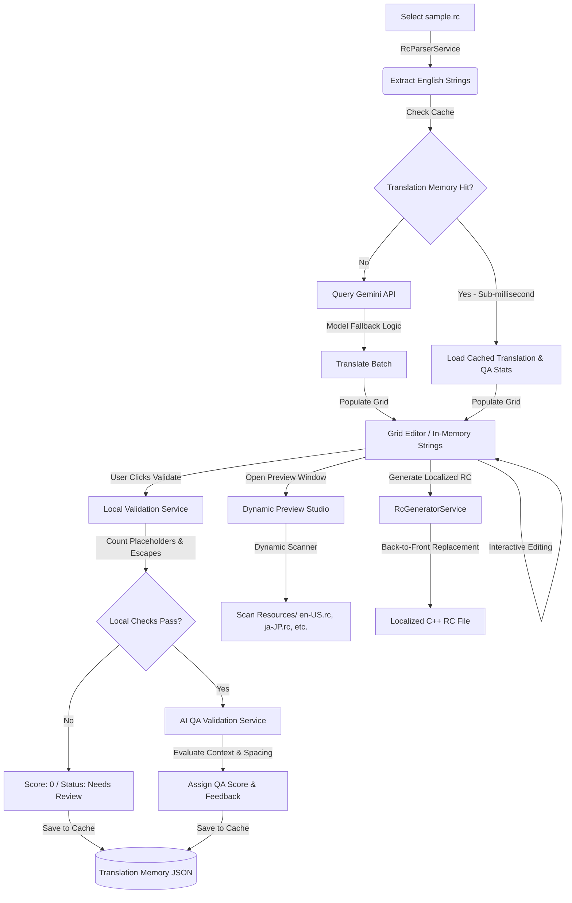

# 🛠️ RcLocalizer: CAD/BIM C++ Resource (.rc) File Localizer

[](https://dotnet.microsoft.com/download/dotnet/10.0)
[]()
[](https://aistudio.google.com/)
[]()

**RcLocalizer** is a premium, high-performance desktop utility designed to solve the complex challenge of localizing Windows C++ Resource Script (`.rc`) files for engineering design software (like Autodesk AutoCAD, Revit, and Inventor). Built with **C# .NET 10** and **WPF**, it leverages the **Google Gemini API** combined with local heuristics to deliver accurate, context-aware, and layout-safe translations.

The codebase adheres strictly to an event-driven **Code-Behind model** (with source files under 200 lines and methods under 10 lines where possible), ensuring supreme readability for presentation to leadership and senior developers.

---

## 📐 The Problem: CAD/BIM UI Localization Challenges

Traditional translation engines (like Google Translate or generic LLMs) fail when translating resource files for engineering applications due to three critical factors:

1. **Strict UI Layout Constraints**: Design tools like Autodesk AutoCAD or Revit feature crowded property grids, docked sidebars, ribbons, and dialog boxes. Translating UI labels into long phrases causes severe text truncation or incorrect wrapping.
2. **Context-Sensitive Technical Vocabulary**: Standard translators fail at engineering domain-specific vocabulary. 
   * *Example*: The word **"Draft"** should be translated as a drawing representation (e.g., *Drafting*), not as a *rough draft* or *gale of wind*. 
   * *Example*: **"Viewport"**, **"Extrude"**, **"Constraint"**, **"Assembly"**, and **"Dimension Style"** have standard, established terms in CAD/BIM products that must be strictly used.
3. **Placeholders & Escape Sequence Preservation**: C++ resource strings often contain formatting placeholders (`%s`, `%d`, `{0}`) and escape characters (`\n`, `\t`). If a translation tool modifies, rearranges, or corrupts these sequences, it leads to immediate **application crashes** (e.g., memory corruption in `printf` or `StringTable` indexers).

### How RcLocalizer Solves These Problems
* **System Instructions for CAD**: The system prompt instructs Gemini to act as a strict Autodesk localization QA system, forcing space-efficiency and selecting terms matching standard CAD dictionary terms.
* **Double-layered Validation**: Combines automated local syntax checks (placeholder & escape sequence counts) with Gemini AI QA validation.
* **Translation Memory (Cache)**: Local caching stores translations along with their validation feedback. Repeated translation/validation runs are resolved in sub-milliseconds, minimizing API usage and cost.
* **Coordinate-Safe Generator**: Rebuilds localized files from bottom-to-top, preventing coordinate shifts or file corruption.

---

## 🔄 Workflow Diagram

The diagram below outlines the parsing, translation, validation, preview, and generation pipeline of **RcLocalizer**:



---

## ✨ Key Features & Architecture

### 1. Secure Environment Configuration
To prevent API keys from leaking into version control, the application stores user settings inside the user's roaming directory:
* **Storage Location**: `%APPDATA%\LocalizerApp\config.env`
* **Format**: `GEMINI_API_KEY=AIzaSyYourActualKeyHere`
* **Auto-Migration**: On start, the app automatically checks for legacy keys in [App.config](file:///f:/Drive%20I/CCtech_Documents/MCP/Localizer_Final/Localizer_App/App.config) and migrates them to the secure `config.env` file, keeping the workspace clean.

### 2. Lexical Tokenizer & Parser
Implemented in [RcParserService.cs](file:///f:/Drive%20I/CCtech_Documents/MCP/Localizer_Final/Localizer_App/Services/RcParserService.cs), the lexer scans resource files, extracting strings exclusively from C++ `STRINGTABLE` blocks while ignoring comments (`//` or `/* */`), macro directives (`#define`), and preprocessor variables. It records character offsets (`StartIndex` and `EndIndex`) of every string literal.

### 3. Back-to-Front Code Rebuilder
Implemented in [RcGeneratorService.cs](file:///f:/Drive%20I/CCtech_Documents/MCP/Localizer_Final/Localizer_App/Services/RcGeneratorService.cs), this service generates the final resource script file. By sorting string replacements in descending order of their file offsets, it replaces translations from the bottom of the file to the top. This ensures that changing a string's length does not invalidate the character coordinates of any preceding text, eliminating file corruption risks.

### 4. Hybrid Double-Layer Validation
* **Local Syntax Guard**: Implemented in [ValidationService.cs](file:///f:/Drive%20I/CCtech_Documents/MCP/Localizer_Final/Localizer_App/Services/ValidationService.cs). It verifies that placeholder counts (`%s`, `%d`, `{0}`, etc.) and escape sequences (`\n`, `\t`) match the original English text. If there is a mismatch, the translation is instantly flagged as `Needs Review` with a score of `0` to prevent compile-time or runtime C++ crashes.
* **Gemini-Powered AI QA**: Implemented in [AiService.cs](file:///f:/Drive%20I/CCtech_Documents/MCP/Localizer_Final/Localizer_App/Services/AiService.cs). It acts as a strict QA auditor, scoring translations from 0 to 100 based on grammatical accuracy, natural context, and suitability for CAD layout space constraints. It flags overly verbose translations and provides detailed feedback.

### 5. Smart Translation Memory & Validation Cache
Implemented in [TranslationMemoryService.cs](file:///f:/Drive%20I/CCtech_Documents/MCP/Localizer_Final/Localizer_App/Services/TranslationMemoryService.cs). The application stores translation pairs, AI QA scores, status tags, and feedback messages inside local JSON files per target culture (e.g. `TranslationMemory/ja-JP.json`). This ensures:
* **Immediate Local Resolutions**: Sub-millisecond loading times for unchanged text.
* **Zero Repeated QA Costs**: Cache entries skip remote LLM calls, saving API quotas.
* **Manual Overrides**: User edits in the DataGrid are cached and preserved.

### 6. Interactive CAD Dialog Preview
The **Preview Window** simulates a CAD dialog box and property inspector.
* **Dynamic Languages**: It scans the [Resources/](file:///f:/Drive%20I/CCtech_Documents/MCP/Localizer_Final/Localizer_App/Resources) directory for any `.rc` files to populate its dropdown dynamically. No language list is hardcoded.
* **Live Overlay**: When displaying the active translation session, the preview overlays the user's in-memory grid edits in real time. Designers can instantly verify how a translated label fits visually within buttons, menus, and property labels before generating files.

---

## 📂 Codebase Directory Map

```
/Localizer_App
│   App.xaml                        <-- WPF Application startup
│   App.xaml.cs                     <-- App initialization
│   App.config                      <-- App configuration (legacy key migration source)
│   AssemblyInfo.cs                 <-- Build assembly details
│   LocalizerApp.slnx               <-- Modern XML-based Visual Studio Solution
│   Localizer_App.csproj            <-- MSBuild project configuration
│   sample.rc                       <-- Input sample English RC file
│   sample_de-DE.rc                 <-- German RC baseline comparison
│   README.md                       <-- You are here
│   RcLocalizer_Guide.md            <-- Developer Guide & Arch Walkthrough
│   RcLocalizer_Concepts.md         <-- C# and WPF concepts index
│
├───Models
│       Models.cs                   <-- ResourceString, TargetLanguage, and constants
│
├───Services
│       AiService.cs                <-- Gemini Service client, Translators, & AI Validation
│       RcParserService.cs          <-- Lexical scanner & token parser for C++ resource syntax
│       RcGeneratorService.cs       <-- Bottom-up/Reverse script rebuilder
│       TranslationMemoryService.cs <-- JSON Cache Service for translations & QA scores
│       ValidationService.cs        <-- Local placeholder and escape sequence validator
│
├───Views
│       MainWindow.xaml             <-- Main workspace layout with side-by-side grids
│       MainWindow.xaml.cs          <-- Controller logic for translations, Cache statistics, & loading
│       PreviewWindow.xaml          <-- Simulative CAD dialog UI mockup
│       PreviewWindow.xaml.cs       <-- Dynamic resource loader and live UI string overlay
│
└───Resources
        en-US.rc                    <-- System default strings file (18 design keys)
        ui_strings.rc               <-- UI backup keys configuration
```

---

## 🚀 Setup & Execution Guide

### Prerequisites
1. **.NET 10.0 SDK** (or compatible .NET 8.0 SDK) installed on your machine.
2. A **Gemini API Key** from [Google AI Studio](https://aistudio.google.com/).

### Step 1: Secure API Key Configuration
Configure the Gemini API key in your user profile:
1. Open a PowerShell command prompt.
2. Create the configuration directory and file:
   ```powershell
   New-Item -ItemType Directory -Path "$env:APPDATA\LocalizerApp" -Force
   New-Item -ItemType File -Path "$env:APPDATA\LocalizerApp\config.env" -Force
   ```
3. Open the file in Notepad:
   ```powershell
   notepad "$env:APPDATA\LocalizerApp\config.env"
   ```
4. Paste the following line, replacing `YOUR_KEY` with your actual Gemini API key, then save and close:
   ```env
   GEMINI_API_KEY=YOUR_KEY
   ```

> [!NOTE]
> Alternatively, if you have a legacy configuration in the project's [App.config](file:///f:/Drive%20I/CCtech_Documents/MCP/Localizer_Final/Localizer_App/App.config), you can paste it there:
> `<add key="GeminiApiKey" value="AIzaSy..."/>`
> The application will automatically migrate it to the secure `%APPDATA%` environment file on the first startup.

### Step 2: Build and Run
Execute the following commands in the project root folder to run the application:
```powershell
dotnet build Localizer_App.csproj
dotnet run --project Localizer_App.csproj
```

---

## 📖 Guided Walkthrough: Testing with `sample.rc`

Follow this step-by-step workflow to verify the translation, local validation, AI QA validation, caching, and visual preview:

1. **Extract English Resource Strings**:
   * Click **[Select RC File...]** and select the [sample.rc](file:///f:/Drive%20I/CCtech_Documents/MCP/Localizer_Final/Localizer_App/sample.rc) file in the root of the project.
   * Under **2. Target Language**, choose **Japanese** (or any other language).
   * Click **[Extract Strings]**. The data grid will populate with 9 extracted strings from the C++ resource script showing keys and original text.
2. **Translate Using Gemini**:
   * Select your preferred model from the top-right model dropdown (e.g. `gemini-2.5-flash`).
   * Click **[Translate]**. The app will batch translate missing strings. The status bar will show "Translating...", followed by "Ready."
   * *Note*: If you run the translation again, the status bar will show `All translations loaded from cache` instantly. The cache stats card will display a `100.0%` Hit Rate, confirming zero API calls were made!
3. **Execute Hybrid Quality Validation**:
   * Click **[Validate]**. The **Validation Results Panel** will slide open on the right side.
   * The local validator checks placeholder counts and empty strings, showing green checks (✔) or red crosses (❌).
   * The AI Quality Validator displays the **Overall QA Score** (e.g., `Overall QA Score: 98 (Excellent)`), average rating, and counts of Excellent, Good, and Needs Review strings.
   * Review the DataGrid's **Score** and **Feedback** columns for each translated row to see Gemini's QA reasoning.
4. **Interactive Editing**:
   * Double-click any translation cell to modify the translated text manually (e.g. to shorten a term).
   * Click **[Validate]** again. The app updates local validations and queries Gemini to re-evaluate the modified text.
5. **Open CAD Simulation Preview**:
   * Click **[Open Preview Window]**. The dialog box simulator will launch.
   * In the top-left dropdown, select **Japanese**. The simulated buttons, menu items (`File`, `Edit`, etc.), and property grid titles will display in Japanese.
   * Try editing a translation in the main grid and see the preview overlay update live!
6. **Rebuild the Localized RC File**:
   * Click **[Generate Localized RC]**. The tool merges the translations back into the `.rc` syntax using back-to-front replacement.
   * Click **[Save Localized RC...]** to save the generated file (e.g., `Resources/ja-JP.rc`).

---

## 🛠️ Developer Resources

For an in-depth understanding of the technical internals and concepts, explore these documents:
* [RcLocalizer Guide (RcLocalizer_Guide.md)](file:///f:/Drive%20I/CCtech_Documents/MCP/Localizer_Final/Localizer_App/RcLocalizer_Guide.md): Architectural layout, code-behind design rules, C++ resource specifications, and API endpoints.
* [RcLocalizer Concepts (RcLocalizer_Concepts.md)](file:///f:/Drive%20I/CCtech_Documents/MCP/Localizer_Final/Localizer_App/RcLocalizer_Concepts.md): Explanation of lexical tokenization, observable collections, asynchronous tasks, and bottom-up file generation.
